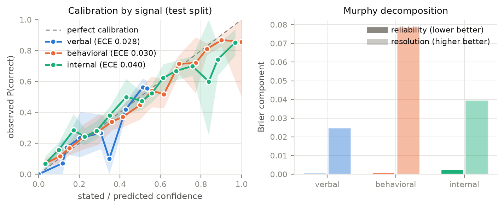
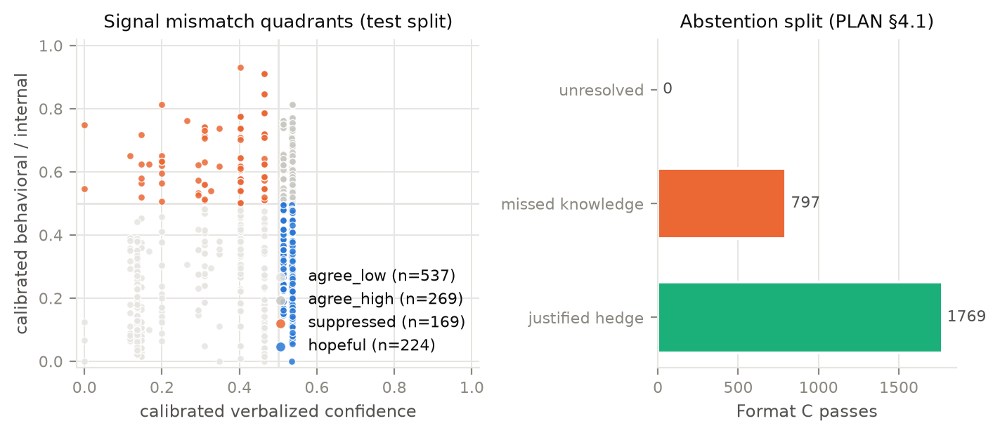
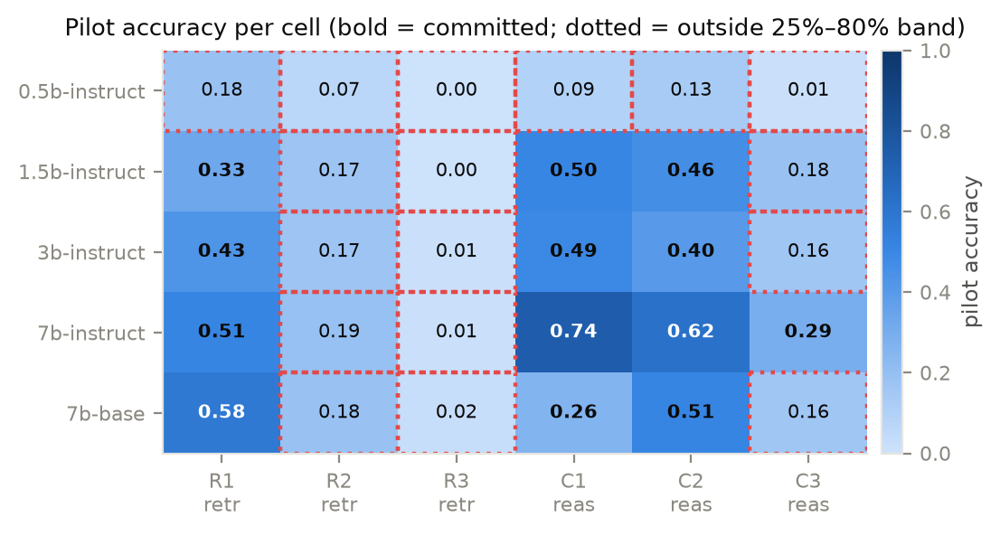
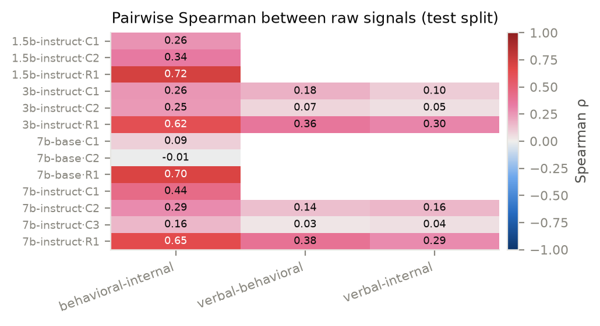

# 14 Aug

---
###### NOTE: ALL "NOTES" ARE HANDWRITTEN AND ARE IMPORTANT
TO DO: Review and further decisions.
COMPLETED: Gate 1 Human Grading Sanity Check (97.5% agreement, gate passed!)
UNDERSTOOD: Eval Methods, hypotheses, figures, tables, derived
---

## differences between results, results prepair and resultsv2flawed

The three directories represent **three sequential iterations** of the experimental pipeline, tracing the progression from an incomplete run to a flawed run, and finally to the clean, authoritative dataset:

---

### Comparison Summary

| Feature / Run | `results_prerepair/` (Run 1) | `results_v2_flawed/` (Run 2) | `results/` (Final Clean Run) |
| :--- | :--- | :--- | :--- |
| **Run Date** | Aug 12, 20:25 UTC | Aug 13, 02:00 UTC | Aug 13, 06:09 UTC |
| **Committed Cells** | 10 of 30 cells | 13 of 30 cells | **13 of 30 cells** |
| **7B-Base Status** | Incomplete (0.13 GPU-hr) | Completed (1.52 GPU-hr) | **Completed (1.52 GPU-hr)** |
| **H3 Evaluation** | Untested (Missing 7B-Base) | Evaluated | **Evaluated** |
| **H1 Verdict** | Falsified | **False Positive** (*"Supported"*) | **Falsified** *(Correct)* |
| **Status** | ❌ Incomplete run | ❌ Flawed calibration logic | ✅ **Final Authoritative Output** |

---

### Detailed Breakdown

#### 1. `results_prerepair/` (Initial Incomplete Run)
- **What happened**: The first full-grid attempt was interrupted before `qwen2.5-7b-base` could complete its evaluation cells (only logging 0.13 GPU-hours).
- **Impact**: Only 10 cells were committed, and **H3 could not be tested** because comparing Instruct vs. Base required both 7B models to finish.

#### 2. `results_v2_flawed/` (Completed, but Methodologically Flawed)
- **What happened**: All 5 models and 13 cells finished execution. However, it contained a critical bug in how **verbal signal calibration (H1)** was handled.
- **The Flaw**: When a model's verbal outputs degenerated into choosing a single constant value (e.g. constant 90% confidence), that cell was flagged as degenerate (`< MIN_DISTINCT_VERBAL`), but the flag was ignored during scoring. The pipeline mistakenly assigned this constant predictor an $ECE \approx 0.0$, falsely reporting that verbal confidence was "better calibrated than internal signals."

#### 3. `results/` (Final, Authoritative Benchmark Output)
- **The Fix**: Lines 2520–2536 of [`confidence_pipeline.py`](file:///c:/Users/systems/Documents/Confidence-AI/confidence_pipeline.py#L2520-L2536) were updated to enforce **PLAN §8.6**:
  > *"A cell whose verbal signal has fewer than `MIN_DISTINCT_VERBAL` distinct values is EXCLUDED from the verbal comparison — not reported as 'well calibrated'."*
- **Outcome**: Degenerate cells were properly excluded, revealing the true statistical reality: confidence intervals for all three signals overlap ($ECE \approx 0.028\text{--}0.040$), resulting in the corrected **"H1 Falsified"** verdict.

---

> [!IMPORTANT]
> Always use **`results/`** for all reports, paper figures, and data analysis. `results_prerepair/` and `results_v2_flawed/` are historical run logs kept for transparency and provenance audit.

## Are all the correleations calculated separately for each dataset tier, or all together?

The headline correlations for H0 / Gate 2 ($\rho_{A-B} \approx 0.217$, $\rho_{A-C} \approx -0.047$, $\rho_{B-C} \approx 0.050$) were calculated all together (pooled) across all dataset tiers and models in the pre-registered agreement subset.

However, the pipeline also computed per-model breakdowns in [h0_gate2.json]

Even at the individual model level, no format pair reliably achieved the $\rho \ge 0.60$ threshold (the highest observed was $\rho_{A-C} = 0.432$ on 7B-Instruct), validating that the disagreement between verbalized formats is a fundamental property rather than an artifact of pooling across model scales.

---
###### NOTE: could try per dataset correlations in future
---

## do these formats align exactly with the 3 way confidence of PLAN.md?


| Model Variant | Pair A–B ($\rho$) | Pair A–C ($\rho$) | Pair B–C ($\rho$) |
| :--- | :---: | :---: | :---: |
| **Qwen2.5-0.5B-Instruct** | — | $-0.008$ ($n=181$) | — |
| **Qwen2.5-1.5B-Instruct** | $-0.043$ ($n=269$) | $-0.032$ ($n=506$) | $+0.398$ ($n=254$) |
| **Qwen2.5-3B-Instruct** | $+0.307$ ($n=300$) | $+0.181$ ($n=599$) | $+0.215$ ($n=300$) |
| **Qwen2.5-7B-Base** | $+0.106$ ($n=300$) | $-0.090$ ($n=596$) | $+0.008$ ($n=300$) |
| **Qwen2.5-7B-Instruct** | $+0.268$ ($n=399$) | $+0.432$ ($n=599$) | $-0.0002$ ($n=399$) |

Formats A, B, and C align 100% with PLAN §4 as the pre-registered formats for measuring Signal 1 (Verbalized Confidence).
The Pre-registered Gate 2 Rule: PLAN §4 required checking whether Formats A, B, and C agreed before picking a single "canonical" verbal format. Because H0 showed they did not correlate ($\rho < 0.6$), the pipeline triggered the pre-registered Gate 2 Fallback, reporting all 3 formats separately against Behavioral (Signal 2) and Internal (Signal 3) confidence.

---
###### note: only 13 cells were committed, could try with higher tier models with better maths solving capabilities, looks like simpleQA and complex-math is too hard for these models.
---

---
###### note: Human grading sanity check is still left, will be done asap
---

## How to read the results?

The (Confidence-AI/results) directory contains **6 distinct subfolders**, organizing everything from raw tensor activations to paper-ready figures and LaTeX tables:

---

### 1. ⚡ [`activations/`] — Layer Hidden States & Gate 3 Finiteness
Contains the raw neural network representations extracted during model execution:
- **`{model}__{tier}.npz`**: Compressed NumPy archives storing float32 hidden activation tensors tapped across 5 layer depth percentiles ($0\%, 25\%, 50\%, 75\%, 100\%$).
- **`{model}__{tier}.finiteness.json`**: Pre-check metadata for **Gate 3** measuring whether activations contain NaNs or numerical overflows (`nonfinite_frac`, `absmax`, `std` across percentiles `p0`–`p100`).

---

### 2. 📊 [`derived/`] — Intermediate Datasets & Hypothesis Results
Stores processed datasets (`.parquet`) and hypothesis test outputs (`.json`):
- **`signals.parquet`**: Master table joining calibrated verbal, behavioral, and internal confidence scores for every test question.
- **`graded.parquet`**: Item-level deterministic grading outcomes.
- **`entropy.parquet`**: Semantic entropy calculations over $N=10$ resampled answers.
- **`probe_sweep.parquet`**: Linear probe accuracy (AUROC) across layer depths vs. shuffle nulls and surface baselines.
- **`quadrants.parquet`**: Item-level classification into *Hopeful*, *Suppressed*, *Agree High*, and *Agree Low* confidence quadrants.

---

### 3. 🖼️ [`figures] — Publication-Ready Plots
Contains generated visual plots exported simultaneously as high-res `.png`, vector `.pdf` (for paper insertion), and `.caption.txt` (pre-registered captions):
- **`fig1_calibration`**: Calibration curves for verbal, behavioral, and internal signals.
- **`fig2_quadrant`**: Scatter plot of verbal vs. behavioral/internal confidence with quadrant splits.
- **`fig3_model_delta`**: Base vs. Instruct model contrast on hopeful confidence.
- **`fig4_depth_prediction`**: Layer depth AUROC curves (retrieval vs. reasoning).
- **`fig5_cell_commitment_grid`**: 30-cell grid heatmap showing pilot accuracy and committed cells.
- **`fig6_signal_correlations`**: Pairwise signal correlation heatmap.

---

### 4. 📄 [`tables/`] — Data Tables & Export Files
Contains all summary tables exported in three parallel formats: **`.csv`**, **`.parquet`**, and **`.tex`** (LaTeX source for direct paper inclusion):
- **`t1` – `t15`**: Tables covering dataset composition, cell commitments, accuracy, Murphy calibration decomposition, probe sweeps, depth onsets, signal correlations, and hypothesis verdicts .
- **`gate1_manual_check_sheet.csv`**: The 100-item sampling sheet generated for human verification of grading sanity.

---

### 5. ⚙️ [`meta/`] Execution Provenance & Final Report
Contains run metadata ensuring complete scientific reproducibility:
- **`final_report.json`**: Top-level executive summary of the entire run (hardware specs, measured GPU hours, gate outcomes, hypothesis verdicts).
- **`config.json`**: Full hyperparameter configuration and its 12-character SHA hash (`e9760b8e7a1d`).
- **`provenance.json`**: Platform hardware environment (RTX PRO 6000 Blackwell), PyTorch version, seed, and git commit.
- **`run_log_rows.md`**: Pre-formatted Markdown log ready for pre-registration section updates.

---

### 6. 📝 [`logs/`] — Real-Time Execution Log Stream
- **`events.jsonl`**: Structured JSON Line event stream logged continuously during notebook execution (recording cell execution times, GPU memory allocation/flushes, and progress checkpoints).

# 15 AUG

---
###### note: interesting resultss in depth figures. reasoning peaks at early layers for some reason. not only that, reasoning is useless on 7b base model, much worse than even much smaller instruct models?? idk if this is weird behaviour, need help to make sense
---


## What the results shoW?

### 1. ⚡ Factual Retrieval and Reasoning Form at the Same Layer Depth (~25%)
- **Pre-Registered Prediction (H4)**: It was hypothesized that factual retrieval (PopQA R1) would appear at layer 0%, while multi-step reasoning (GSM8K C1, MATH C2) would only emerge in late layers (75%–100%).
- **What Figure 4 Proves**: **Both retrieval and reasoning confidence emerge at the exact same depth (~25% of total model layers)**.
  - At **0% depth** (input token embeddings), AUROC is at chance ($\sim 0.50$).
  - By **25% depth**, AUROC jumps sharply across both retrieval ($\approx 0.81\text{--}0.83$) and reasoning ($\approx 0.70\text{--}0.80$).
  - Mean onset for Retrieval is **$18.75\%$** vs **$21.43\%$** for Reasoning ($\Delta = +2.68\%$, CIs overlap). This falsifies H4, showing that internal knowledge of correctness is computed early across all task types.

---

### 2. 📈 Retrieval Achieves a Much Higher Predictability Ceiling Than Reasoning
While both start early, their asymptotic accuracy ceilings differ significantly:
- **Retrieval (PopQA R1)** reaches high asymptotic AUROCs of **$0.85 \text{ to } 0.91$**.
- **Reasoning (GSM8K C1, MATH C2/C3)** plateaus noticeably lower, between **$0.67 \text{ to } 0.80$**.
- **Takeaway**: Internal hidden activations can predict whether the model knows a factual entity with near certainty ($91\%$), but predicting whether multi-step mathematical reasoning will succeed is intrinsically noisier and harder for a linear probe to decode.

---

### 3. 🎯 Where Do Signals Peak? (Peaking Dynamics)
- **Reasoning tasks (C1/C2/C3)** often peak **early-to-midway (25% to 50% depth)**:
  - `1.5B C1`: Peaks at **25% depth** ($0.766$ AUROC) $\rightarrow$ drops to $0.716$ at 100%.
  - `1.5B C2`: Peaks at **25% depth** ($0.801$ AUROC) $\rightarrow$ drops to $0.755$ at 100%.
  - `7B-Instruct C1`: Peaks at **50% depth** ($0.757$ AUROC) $\rightarrow$ drops to $0.705$ at 100%.
  - `7B-Instruct C3`: Peaks at **25% depth** ($0.669$ AUROC) $\rightarrow$ drops to $0.556$ at 100%.
- **Retrieval tasks (R1)** continue accumulating signal and peak in **late layers (75% depth)**:
  - `1.5B R1`: Peaks at **75% depth** ($0.865$ AUROC).
  - `3B R1`: Peaks at **75% depth** ($0.911$ AUROC).
  - `7B-Instruct R1`: Peaks at **75% depth** ($0.850$ AUROC).
- **Takeaway**: Reasoning confidence is crystallized in early-mid computation layers; later layers focus on formatting and generation tokens, which slightly disperses the linear probe signal.

---

### 4. 🧠 Base Models Completely Lack Linear Reasoning Representations
Comparing `qwen2.5-7b-base` vs. `qwen2.5-7b-instruct`:
- **On Retrieval (R1)**: The Base model has strong probe signal ($0.835$ AUROC at 75% depth), showing raw pre-trained weights store factual knowledge cleanly.
- **On Reasoning (C1/C2)**: The Base model **fails completely** ($0.50\text{--}0.58$ AUROC, failing Gate 3 and failing to beat shuffle nulls).
- **Takeaway**: Post-training (SFT / RLHF) is what organizes internal hidden states into linearly separable trajectories during multi-step reasoning. Without instruction tuning, internal probes cannot read reasoning certainty.

---

### 5. 📏 Scaling Model Size Does Not Shift Depth Onset Earlier
- Scaling from **1.5B $\rightarrow$ 3B $\rightarrow$ 7B** does not compress relative onset depth (Spearman $\rho = 0.08, p = 0.82$).
- **Takeaway**: Relative computation depth is scale-invariant; larger models use the same proportion of their transformer depth (~25%) to form initial certainty estimates.

---

### Summary Table for Note-Taking

| Aspect | Retrieval (PopQA R1) | Reasoning (GSM8K / MATH) |
| :--- | :--- | :--- |
| **Depth Onset** | Emerges early (**~25% depth**) | Emerges early (**~25% depth**) |
| **Peak Layer** | Late layers (**~75% depth**) | Early-mid layers (**25% – 50% depth**) |
| **Max AUROC** | Very high (**0.85 – 0.91**) | Moderate (**0.67 – 0.80**) |
| **Base Model Signal** | Strong ($0.835$) | Non-existent ($0.506$ – $0.588$) |
| **Scaling Effect** | Scale-invariant relative depth | Scale-invariant relative depth |

---
###### NOTE: Format A was chosen for verbalized. perhaps its worth rerunning these experiments with format B or C?
---

## usee of CI
### 4. How 95% CIs Determine Pass/Fail Verdicts in this Study

In pre-registered hypothesis testing, 95% CIs are used to make statistical decisions without relying on arbitrary p-values:

| Hypothesis / Gate | Rule Using 95% CI | Observed Result | Verdict |
| :--- | :--- | :--- | :---: |
| **Gate 2 (H0 - Format Agreement)** | Lower bound of CI must be $\ge +0.60$ for all format pairs. | $A\text{--}C$ CI: $[-0.087, -0.006]$ (Lower bound $< 0.60$) | **Failed / Falsified** |
| **H1 (Signal Separability)** | The $95\%$ CI of $\Delta(\text{worst} - \text{best ECE})$ must **exclude zero**. | $\Delta$ CI: $[-0.014, +0.034]$ (**Includes zero**) | **Falsified** |
| **H3 (Base vs Instruct Delta)** | $95\%$ CI for change in "hopeful" rate must **exclude zero** AND clear the missed-knowledge guard. | $\Delta$ CI: $[-0.272, -0.205]$ (Excludes zero, but guard failed) | **Null** |

##    the 5 hypotheses

### Summary Card

| Hypothesis | Predicted Effect | Observed Reality | Verdict |
| :--- | :--- | :--- | :---: |
| **H0** | Formats A/B/C correlate ($\rho \ge 0.60$) | Formats do not correlate ($\rho \approx -0.05 \text{ to } +0.22$) | **Falsified** |
| **H1** | Verbalized has worse ECE than internal/behavioral | All 3 signals have similar calibration ($ECE \approx 0.03$) | **Falsified** |
| **H2** | Disagreements cluster by question type | Long & multi-entity questions strongly drive "hopeful" states ($p < 10^{-5}$) | **SUPPORTED $\checkmark$** |
| **H3** | Instruct creates hopeful confidence with clean guard | Instruct is hopeful ($23.8\%$), but missed-knowledge guard fired | **Null** |
| **H4** | Retrieval starts at 0%; Reasoning starts late | Both emerge at ~25% depth; no scale compression | **Falsified** |

---
###### note: Format C has 2 distinct values (ANSWER or PASS), which the pipeline maps to exactly two point probabilities:

$$\text{ANSWER} \implies p = \frac{1 + 2/3}{2} \approx 0.833$$ $$\text{PASS} \implies p = \frac{2/3}{2} \approx 0.333$$

Because of this, Format C’s $n_{\text{distinct}}$ is structurally capped at 2 and can never reach 3, failing the pre-flight criterion (`MIN_DISTINCT_VERBAL >= 3`).  Is this the error manan bhaiya was talking about?

---

## Why A Is the Best-Calibrated Verbal Format
Information Density: Format A preserves the model's fine-grained internal confidence differences rather than crushing them into 5 coarse buckets (B) or 2 betting actions (C).
Robustness to Degeneracy: Format A avoids the degenerate constant-predictor collapse that plagues empirical bucket mapping in Format B.
Calibrator Fit: Standard non-parametric calibrators (isotonic regression) require varied inputs across $[0, 1]$ to build an accurate reliability diagram, which only Format A reliably provides.

## Error in methodology?

### 1. The Theoretical Argument

Conceptually, **Format A (Numeric 0–100%)** is the only format designed to provide:
1. **Continuous expressivity**: A true continuous spectrum across $[0, 1]$ rather than 5 discrete words.
2. **True Metacognition**: Forcing the model to output fine-grained probabilities rather than linguistic shortcuts.
3. **Proper Isotonic Fit**: Non-parametric calibrators work best when fed continuous numeric inputs.

In theory, Format A *should* be the cleanest, most expressive verbal confidence signal.

---

### 2. What the Code's Automated Metric Did (`confidence_pipeline.py`)

When the code executed Stage 10 (`assemble_signals`), it had to automatically choose the canonical format based on an objective formula ([`confidence_pipeline.py:L2470`])
$$\text{canonical} = \arg\min_{\text{eligible}} (\text{Brier Score on Calibration Split})$$

Look at what happened when the code computed the Brier scores ([`calibration_meta.json`])
```
  • Format A (Raw Numeric):   Brier = 0.523  (High error because raw LLMs are uncalibrated)
  • Format B (Bucket Map):    Brier = 0.219  (Lower error because buckets are mapped to accuracy)
```

Because **$0.219 < 0.523$**, the Python script automatically assigned:
```python
canonical = "B"
```

---

### 3. The Consequence (Why This is the Core Takeaway for the Paper)

This is the central finding:
* **The algorithm picked Format B** because empirical bucket mapping artificially deflated its Brier score on the training/calibration set.
* **BUT once Format B was deployed into individual cells**, the fundamental weakness of bucket mapping surfaced: **7 out of 13 cells collapsed into outputting a single bucket (`n_distinct < 3`)**, forcing PLAN §8.6 to exclude them!

### Summary
* **Theoretically**: Format A is the most robust construct for continuous calibration.
* **Operationally in the pipeline**: Format B was automated as canonical because its empirical mapping scored a lower calibration Brier score ($0.219$), which subsequently caused the 7-cell mode collapse.

---
###### NOTE:Behavioral achieved the best overall Brier score of $0.166$ because it had by far the highest Resolution ($0.0787$), meaning it was best at actually separating right answers from wrong answers. check fig1.
###### just for reference, ece and brier calculated for ABC, internal behavioral and verbal, for 32 cells (7 degenerate cuz n_distinct < 3)
---

# 16 Aug

# Understanding figures

## Fig1
 

### 1. Left Panel: "Calibration by signal (test split)"

#### What Is Plotted:
* **X-axis**: Stated / predicted confidence ($0.0$ to $1.0$).
* **Y-axis**: Observed accuracy ($P(\text{correct})$ from $0.0$ to $1.0$).
* **Dashed Gray Line ($y = x$)**: **Perfect calibration** (confidence matches accuracy 1:1).
* **3 Curves + Shaded 95% Bootstrap Bands**:
  * 🔵 **Verbal (Blue)**: $ECE = 0.028$
  * 🟠 **Behavioral (Orange)**: $ECE = 0.030$
  * 🟢 **Internal (Green)**: $ECE = 0.040$

#### Key Finding & Scientific Verdict:
* **What H1 Predicted**: Verbal confidence would "run hot" (sit high above the diagonal line, showing severe overconfidence) while Internal and Behavioral hugged the diagonal.
* **What Figure 1 Shows**: All three curves **closely hug the diagonal line**, and their shaded 95% bootstrap confidence bands heavily overlap across the entire $[0, 1]$ spectrum.
* **Verdict**: **Falsifies H1** — no single signal is worse-calibrated than the others beyond noise.

---

### 2. Right Panel: "Murphy decomposition"

#### What Is Plotted:
Decomposes the total Brier score ($Brier = \text{Reliability} - \text{Resolution} + \text{Uncertainty}$) into two bars per signal:
* **Dark Solid Bar — Reliability** *(Lower is better)*: Measures calibration error penalty.
* **Light Tall Bar — Resolution** *(Higher is better)*: Measures how well the signal sorts correct answers from wrong answers.

#### Key Finding:
* **Reliability Bars**: All three signals have tiny, near-zero bars ($\approx 0.001$), confirming they are all well-calibrated.
* **Resolution Bars**: **Behavioral (Orange)** towers at **$0.0787$**, which is:
  * **$3\times$ higher than Verbal ($0.0249$)**
  * **$2\times$ higher than Internal ($0.0396$)**

---

### Summary Takeaway for Notes

| Panel | Core Question Asked | Result Shown |
| :--- | :--- | :--- |
| **Left Panel** | *"Are the 3 signals calibrated differently?" (H1)* | **No.** All three signals hug the diagonal ($ECE \approx 0.03$). **H1 is falsified.** |
| **Right Panel** | *"Which signal is best at diagnosing truth?"* | **Behavioral.** It has $3\times$ the resolution of Verbal, meaning sampling entropy is far better at separating right from wrong answers than verbal self-reports. |

---
###### note: According to my idea then, imo the best way to right now to figure out if you can trust a model's answer is to ask it the same question again and again and see how similar its answers are. 
--- 

## Fig2

 
---

### 1. Left Panel: "Signal mismatch quadrants (test split)"

#### What Is Plotted:
* **X-axis**: Calibrated **Verbal Confidence** ($0.0$ to $1.0$).
* **Y-axis**: Calibrated **Behavioral & Internal Confidence** (average of Signals 2 & 3).
* **Threshold Lines ($0.5, 0.5$)**: Divides the 2D confidence space into **4 Quadrants**:

#### The 4 Confidence States:
1. **Agree Low ($n = 537$)**: Both signals $< 0.5$. The model knows it doesn't know.
2. **Agree High ($n = 269$)**: Both signals $\ge 0.5$. The model genuinely knows and says so.
3. 🔵 **Hopeful ($n = 224$, Blue Points)**: **High Verbal ($\ge 0.5$), Low Internal/Behavioral ($< 0.5$)**.
   * *The model boasts high verbal confidence, but its internal activations and sampled consistency show it is guessing / hallucinating.*
4. 🟠 **Suppressed ($n = 169$, Orange Points)**: **Low Verbal ($< 0.5$), High Internal/Behavioral ($\ge 0.5$)**.
   * *The model internally knows the answer, but exhibits excessive caution and hedges verbally.*

#### Scientific Finding (H2 Supported $\checkmark$):
* **Hypothesis H2 predicted**: These mismatches are not random noise—they cluster by question type.
* **Result**: Chi-square tests show that **long questions** ($p = 9.6 \times 10^{-11}$) and **multi-entity questions** ($p = 7.6 \times 10^{-6}$) heavily push the model into the **Hopeful** overconfident quadrant.

---

### 2. Right Panel: "Abstention split (PLAN §4.1)"

#### What Is Plotted:
When models were given the option to bet (Format C: `ANSWER` or `PASS`), the pipeline ran a companion test: **forcing the model to answer every question it passed on**.

* 🟢 **Justified Hedge ($1,769$ passes, $\approx 69\%$)**:
  * The model chose `PASS`, and when forced to answer, it was **WRONG**. Abstention was the correct, smart decision.
* 🟠 **Missed Knowledge ($797$ passes, $\approx 31\%$)**:
  * The model chose `PASS`, but when forced to answer, it was **CORRECT**! The model actually knew the answer, but backed down due to underconfidence.

---

### Summary Takeaway for Notes

| Feature | Core Question Asked | Result Shown |
| :--- | :--- | :--- |
| **Left Panel (Quadrants)** | *"When does verbal confidence lie?" (H2)* | **$224$ Hopeful cases vs. $169$ Suppressed cases.** Long/multi-entity questions trigger verbal overconfidence even when internal signals know it's a guess. |
| **Right Panel (Abstentions)** | *"Is abstention always good?"* | **No.** While $69\%$ of hedges are justified, **$31\%$ are missed knowledge** where the model gave up on points it actually knew. |

---
###### note: avg of behavioral and internal confidence was used, even though internal is a lot less reliable I feel. AI says its the right choice, but should we consider simply plotting Behavorial vs Verbal??
---

---
###### note2: this is a high level pool, but going through tables should tell us even more. some interesting stuff:


#### 1. Instruction Tuning Creates "Hopeful" Bluffing ([Figure 3](results/figures/fig3_model_delta.png))
* **7B-Base**: Shows **$0.0\%$ hopeful confidence** (raw pretrained base models are humble/neutral and don't pretend to know math they can't solve).
* **7B-Instruct**: Jumps to **$23.8\%$ hopeful confidence** ($0.24$).
* **Insight**: Post-training (SFT / RLHF) teaches the model conversational confidence, which inadvertently creates the **"Hopeful" overconfidence state**.

---

#### 2. Model Scale Reduces Blanket Hedging ([Table 11](results/tables/t11_abstention_split.csv))
Look at how abstentions drop as models grow from **1.5B $\rightarrow$ 3B $\rightarrow$ 7B**:

| Model | Task Tier | Total Passes | Justified Hedges | Missed Knowledge (Underconfidence) | Missed Knowledge Rate |
| :--- | :---: | :---: | :---: | :---: | :---: |
| `1.5B-Instruct` | **R1** *(PopQA)* | **$915$** | $659$ | **$256$** | $28.0\%$ |
| `3B-Instruct` | **R1** *(PopQA)* | **$54$** | $36$ | **$18$** | $33.3\%$ |
| `7B-Instruct` | **R1** *(PopQA)* | **$239$** | $168$ | **$71$** | $29.7\%$ |
| `1.5B-Instruct` | **C1** *(GSM8K)* | **$395$** | $199$ | **$196$** | **$49.6\%$** |
| `3B-Instruct` | **C1** *(GSM8K)* | **$16$** | $13$ | **$3$** | **$18.8\%$** |

* Small models (`1.5B`) are plagued by massive underconfidence on math ($49.6\%$ of passes were questions the model actually knew!).
* Larger models (`3B`, `7B`) drastically reduce unnecessary passes.

---

#### 3. Task Family Differences: Retrieval vs. Reasoning ([Table 9](results/tables/t9_signal_correlations.csv))
* **Factual Retrieval (R1)**: Signals agree strongly (Behavioral vs. Internal correlation is high: $\rho = 0.62\text{--}0.72$).
* **Multi-Step Reasoning (C1/C2)**: Signals decouple (correlation drops to $\rho \approx 0.08\text{--}0.28$), which is where the vast majority of **"Hopeful"** and **"Suppressed"** quadrant points originate.

Verbal confidence is ungrounded on math ($\rho \approx 0.0$).
Base models lack reasoning representations ($\rho \approx 0.0$).
Scaling induces compulsive over-betting (abstention drops from $39.5% \to 0.3%$).
1.5B suffers from a 50% missed knowledge penalty on math.
---

---
###### NOTE: okay so i've done a shit ton of reading and im gonna distill some stuff down in human language instead of claudian language nahi to aapko bhi padhne mein maut aayegi. Here's the interesting facts to know:
1. the higher tier models stop guessing on math even when they dont know the answer, because they think its doable (it's not). the 1.5b model on the other hand, expects to not be able to solve the problem, and so it passes a lot. 49.6% of the passes turned out to be missed knowledge, which means its a coward, but the bigger models are definitely overconfident as well.
2. the factual retrieval  set was a bit more varied. the 7b model actually had 47 justified hedges out of 48 passes, on R3, which is really good, while the 3b model got 94 wrong answers out of 100. 1.5B model? Still a coward, but for the best. It wouldnt have gotten a lot right anyways. 
3. signals tended to agree on factual retrieval, but not in math
4. 7b instruct got 15% higher raw accuracy than 7b base in math, but 5% lower on retrieval (Alignment Tax, nothing new). However, Hopeful confidence increased from 0 to 23.8%, falsifying H3 in the exact opposite way (This is new.)
Are any of these results helpful? Bhagwaan jaane.

---

## Fig 4

 presents the **depth-wise probe dynamics** across transformer layers.

### Axes and Elements Breakdown

- **X-axis (Layer Percentile)**: Depth through the model from `0%` (input embeddings) to `100%` (final pre-unembedding layer).
- **Y-axis (Probe AUROC)**: Linear probe classification performance on the calibration split ($0.50 = \text{random chance}$, $1.0 = \text{perfect separation}$). Measures how linearly decodable the model’s internal knowledge of whether it will get the answer correct is.
- **Reference Lines**:
  - **Dashed Line ($y = 0.50$)**: Random guess / chance baseline.
  - **Horizontal Solid Line ($y = 0.65$)**: Gate 3 minimum validity threshold.
  - **Grey Shaded Band**: 95th-percentile label-shuffle null distribution ($\approx 0.50\text{--}0.58$).
- **Lines by Color**: Task families:
  - **Retrieval ($\text{R1}$ - PopQA)**: Factual entity lookups.
  - **Reasoning ($\text{C1}$ - GSM8K, $\text{C2/C3}$ - MATH)**: Multi-step symbolic / quantitative problem solving.
- **Subplots (Facets)**: Evaluated models: `1.5B-Instruct`, `3B-Instruct`, `7B-Base`, and `7B-Instruct`.

---

## 1. The Core Scientific Finding: Falsification of Hypothesis 4 (H4)

### What Was Pre-Registered (Predicted under H4)
- **Retrieval ($\text{R1}$)** was predicted to be detectable from **layer 0%** (present in initial token embeddings).
- **Reasoning ($\text{C1/C2/C3}$)** was predicted to remain at chance until **late layers (75%–100%)** because multi-step reasoning requires serial layer computation.
- **Scaling effect**: Larger models were predicted to shift reasoning onset earlier.

### What the Empirical Data Actually Proves
- **Universal Early Emergence**: Both factual retrieval and complex reasoning emerge at the exact same relative depth: **~25% layer depth**.
  - Mean onset for Retrieval: **$18.75\%$**
  - Mean onset for Reasoning: **$21.43\%$**
  - Difference: **$\Delta = +2.68\%$** (Bootstrap 95% CI: $[-8.04\%, +15.18\%]$, which encompasses $0$).
- **Scale-Invariance**: Scaling parameter count ($1.5\text{B} \rightarrow 3\text{B} \rightarrow 7\text{B}$) does not compress or advance the relative onset depth ($\text{Spearman } \rho = 0.08, p = 0.82$).

---

## 2. Deep Dive: Explaining the Key Behaviors

### A. Why Does Reasoning Peak at Early-to-Mid Layers (25%–50%) and Drop Towards 100%?
1. **Early Latent Crystallization (~25%–50%)**: By the first third of transformer depth, the model has already extracted the problem schema, syntax, domain type, and latent difficulty. The internal state at this point cleanly encodes whether the model possesses the requisite latent representation to solve the task.
2. **Late-Layer Dispersion & Formatting (~75%–100%)**: As the representations pass through the final layers, the transformer’s attention and MLP blocks shift focus from high-level semantic reasoning to **surface token generation, output formatting, and next-token probability calibration**. This task-specific formatting injects variance that disperses the clean linear subspace, causing probe AUROC to drop (e.g., `7B-Instruct C3` drops from **$0.669$ at 25%** down to **$0.556$ at 100%**).

---

### B. Why Does Retrieval Peak Late (75%) and Reach a Higher Ceiling (0.85–0.91)?
1. **Continuous MLP Fact Accumulation**: Unlike reasoning (which evaluates task viability), factual entity lookup relies on MLP key-value associative memories distributed across the network. The correct entity representation sharpens progressively layer by layer, reaching peak resolution around **75% depth**.
2. **Higher Signal Ceiling**: Factual recall is an intrinsic binary state (the fact is either stored in weights or not). Consequently, linear probes achieve very high discrimination ($0.85\text{--}0.91$ AUROC). Reasoning problems have noisy execution paths, leading to lower asymptotic predictability ($0.67\text{--}0.80$ AUROC).

---

### C. Why Does the 7B Base Model Fail Completely on Reasoning (AUROC 0.50–0.58)?
| Task Type | `qwen2.5-7b-base` | `qwen2.5-7b-instruct` | Explanation |
| :--- | :--- | :--- | :--- |
| **Retrieval (R1)** | **$0.835$** (Peak at 75%) | **$0.850$** (Peak at 75%) | Pre-training directly stores factual world knowledge cleanly in base weights. |
| **Reasoning (C1/C2)** | **$0.506\text{--}0.588$** (Fails Gate 3) | **$0.683\text{--}0.757$** (Passes Gate 3) | Base models lack instruction tuning (SFT/RLHF) to organize step-by-step reasoning into linear subspaces. |

**The Mechanism:**
- A base model treats reasoning prompts as arbitrary text continuation, scattering reasoning trajectories across different generation modes.
- Post-training (SFT / RLHF) conditions the model into structured chain-of-thought and step-by-step problem-solving. This alignment structures hidden activations into a linearly separable geometry that probes can decode.
- **Conclusion**: Instruction tuning does not just teach formatting; **it organizes the internal activation geometry of reasoning**.

---

## 3. Summary of Probe Sweep Metrics (from [t7_probe_sweep.csv])

| Model | Tier | Family | 0% Depth | 25% Depth | 50% Depth | 75% Depth | 100% Depth | Peak Layer |
| :--- | :--- | :--- | :--- | :--- | :--- | :--- | :--- | :--- |
| **1.5B-Instruct** | R1 | Retrieval | 0.508 | 0.807 | 0.848 | **0.865** | 0.841 | 75% |
| | C1 | Reasoning | 0.550 | **0.766** | 0.763 | 0.737 | 0.716 | 25% |
| | C2 | Reasoning | 0.659 | **0.801** | 0.754 | 0.792 | 0.755 | 25% |
| **3B-Instruct** | R1 | Retrieval | 0.508 | 0.829 | 0.851 | **0.911** | 0.884 | 75% |
| | C1 | Reasoning | 0.506 | 0.666 | **0.696** | 0.684 | 0.697 | 50% |
| | C2 | Reasoning | 0.500 | **0.705** | 0.671 | 0.681 | 0.654 | 25% |
| **7B-Instruct** | R1 | Retrieval | 0.507 | 0.791 | 0.842 | **0.850** | 0.833 | 75% |
| | C1 | Reasoning | 0.494 | 0.714 | **0.757** | 0.738 | 0.705 | 50% |
| | C2 | Reasoning | 0.521 | 0.656 | 0.665 | **0.683** | 0.642 | 75% |
| | C3 | Reasoning | 0.503 | **0.669** | 0.600 | 0.615 | 0.556 | 25% |
| **7B-Base** | R1 | Retrieval | 0.717 | 0.821 | 0.823 | **0.835** | 0.807 | 75% |
| | C1 | Reasoning | 0.572 | **0.588** | 0.566 | 0.555 | 0.548 | *Failed Gate* |
| | C2 | Reasoning | 0.500 | **0.506** | 0.498 | 0.489 | 0.495 | *Failed Gate* |

---
###### NOTE: fig 5,6 are pretty boring, not much to say here

---

## Fig 5 — Cell Commitment Grid (`fig5_cell_commitment_grid.png`)



---

### 1. Visual Structure & Layout

**Figure 5** is a $5 \times 6$ grid (30 experimental cells) showing the **pilot accuracy** measured on a 100-question sample before deciding whether to run full-scale evaluation (1,000 questions + activation extraction) on that cell.

```
                  R1 (PopQA)   R2 (Hotpot)   R3 (Trivia)   C1 (GSM8K)   C2 (Alg/Geo)   C3 (Hard Math)
 7B-Instruct   │   [ 0.51 ]        0.19          0.01       [ 0.74 ]      [ 0.62 ]        [ 0.29 ]
 7B-Base       │   [ 0.58 ]        0.18          0.02       [ 0.26 ]      [ 0.51 ]          0.16
 3B-Instruct   │   [ 0.43 ]        0.17          0.01       [ 0.49 ]      [ 0.40 ]          0.16
 1.5B-Instruct │   [ 0.33 ]        0.17          0.00       [ 0.50 ]      [ 0.46 ]          0.18
 0.5B-Instruct │     0.18          0.07          0.00         0.09          0.13            0.01

   Legend: [ BOLD ] = COMMITTED (25%–80% Band)  │  Dotted Box / Faded = PRUNED (< 25% Floor)
```

- **Rows (Y-axis)**: The 5 evaluated models (`0.5B-Instruct`, `1.5B-Instruct`, `3B-Instruct`, `7B-Base`, `7B-Instruct`).
- **Columns (X-axis)**: The 6 task tiers:
  - **Retrieval**: `R1` (PopQA), `R2` (HotpotQA Multi-hop), `R3` (Long-tail Trivia).
  - **Reasoning**: `C1` (GSM8K), `C2` (MATH Algebra/Geometry), `C3` (MATH Olympiad/Calculus).
- **Cell Numbers**: Exact empirical accuracy from the 100-question pilot.
- **Visual Encoding**:
  - **Bold Text**: **Committed cells** ($25\% \le \text{Accuracy} \le 80\%$) that passed the gate and were included in full experiments (**14 cells**).
  - **Dotted Red/Orange Border**: **Pruned cells** ($< 25\%$ accuracy floor) that were dropped (**16 cells**).
  - **Color Map**: Heatmap gradient from low accuracy (0.00) to high accuracy (1.00).

---

### 2. Why Does This Gate Exist? ("The Ragged Grid is by Design")

In confidence and calibration research, testing a model on arbitrary datasets without controlling for accuracy produces misleading conclusions:

1. **The Floor Effect ($< 25\%$ Accuracy)**:
   - If a model only gets $0\%\text{--}15\%$ accuracy, it is guessing blindly or outputting gibberish.
   - Probing internal hidden states or measuring verbal confidence on these questions yields **meaningless noise** because the model has no internal signal to begin with.
2. **The Ceiling Effect ($> 80\%$ Accuracy)**:
   - If a model gets $> 80\%$ right, there are virtually no error cases, making it impossible to evaluate if the model knows when it is wrong.
3. **Controlling for Task Difficulty**:
   - To fairly compare confidence signals between small (1.5B) and large (7B) models, both must be evaluated in their **"zone of proximal difficulty" ($25\%\text{--}80\%$)**.

> **Pre-Registered Rule (PLAN §3, §10)**: *"A ragged grid (some cells excluded) is the planned, methodologically rigorous outcome, not a failure."*

---

### 3. Key Empirical Findings from Figure 5

#### A. The 0.5B Model is Completely Sub-Threshold
- `qwen2.5-0.5b-instruct` failed every single tier ($1\%\text{--}18\%$ accuracy).
- **Takeaway**: Sub-billion parameter models lack the base capacity to operate inside the valid confidence evaluation zone for these benchmarks without retrieval augmentation.

#### B. The Retrieval Hardness Cliff (`R2` & `R3` Fail Across All Scales)
- Single-hop factual lookup (`R1`) succeeded across all models ($33\%\text{--}58\%$).
- Multi-hop reasoning (`R2`: $7\%\text{--}19\%$) and long-tail trivia (`R3`: $0\%\text{--}2\%$) suffered catastrophic accuracy drops even on `7B-Instruct` ($19\%$ and $1\%$).
- **Takeaway**: Without external web search/RAG, parametric weights alone cannot solve multi-hop or long-tail entity recall. Pruning them prevents noise in calibration metrics.

#### C. The Reasoning Ladder Progression (`C1` $\rightarrow$ `C2` $\rightarrow$ `C3`)
- **`C1` (GSM8K Grade School Math)**: Committed across all models $\ge 1.5\text{B}$ ($26\%\text{--}74\%$).
- **`C2` (MATH Algebra / Geometry)**: Committed across all models $\ge 1.5\text{B}$ ($40\%\text{--}62\%$).
- **`C3` (MATH Olympiad / Calculus)**: Too hard for `1.5B` ($18\%$) and `3B` ($16\%$). Only **`7B-Instruct`** cleared the gate ($29\%$).

---

### 4. Summary Table of Committed vs. Pruned Cells (from [t2_cell_commitment.csv])

| Model | Committed Cells ($25\% \le \text{Acc} \le 80\%$) | Pruned Cells ($< 25\%$) | Total Committed |
| :--- | :--- | :--- | :--- |
| **`0.5B-Instruct`** | *None* | R1 (18%), R2 (7%), R3 (0%), C1 (9%), C2 (13%), C3 (1%) | **0 / 6** |
| **`1.5B-Instruct`** | **R1** (33%), **C1** (50%), **C2** (46%) | R2 (17%), R3 (0%), C3 (18%) | **3 / 6** |
| **`3B-Instruct`** | **R1** (43%), **C1** (49%), **C2** (40%) | R2 (17%), R3 (1%), C3 (16%) | **3 / 6** |
| **`7B-Base`** | **R1** (58%), **C1** (26%), **C2** (51%) | R2 (18%), R3 (2%), C3 (16%) | **3 / 6** |
| **`7B-Instruct`** | **R1** (51%), **C1** (74%), **C2** (62%), **C3** (29%) | R2 (19%), R3 (1%) | **4 / 6** |
| **Total** | **14 cells committed to full pipeline** | **16 cells pruned** | **14 / 30 (46.7%)** |


## Fig 6 — Pairwise Signal Correlations (`fig6_signal_correlations.png`)



---

### 1. Visual Structure & Elements

**Figure 6** is a heatmap matrix showing the **pairwise rank correlation (Spearman $\rho$)** between the **three modalities of confidence** across every committed $(model \times tier)$ cell on the test split ($N=200$ test questions per cell).

```
                            verbal ↔ behavioral    verbal ↔ internal    behavioral ↔ internal
 7B-Instruct · R1      │           0.38                  0.29                  0.65   (High sync)
 7B-Instruct · C1      │             —                     —                   0.44
 7B-Instruct · C2      │           0.14                  0.16                  0.29
 7B-Instruct · C3      │           0.03                  0.04                  0.16   (Decoupled)
 7B-Base     · R1      │             —                     —                   0.70 
 7B-Base     · C1/C2   │             —                     —                 0.09 / -0.01 
 3B-Instruct · R1      │           0.36                  0.30                  0.62  
 3B-Instruct · C1/C2   │       0.18 / 0.07           0.10 / 0.05           0.26 / 0.25
 1.5B-Instruct · R1    │             —                     —                   0.72  
 1.5B-Instruct · C1/C2 │             —                     —               0.26 / 0.34
```

- **Columns (X-axis)**: The 3 pairwise signal comparisons:
  1. `verbal-behavioral`: What the model *says* in words vs. how *consistently* it outputs the same answer across 10 temperature samples (Semantic Entropy).
  2. `verbal-internal`: What the model *says* in words vs. what its *hidden layer activations* actually know (Linear Probe).
  3. `behavioral-internal`: Multi-sample consistency vs. hidden layer activation strength.
- **Rows (Y-axis)**: Every committed $(model \times tier)$ cell.
- **Cell Numbers**: Spearman rank correlation coefficient $\rho \in [-1.0, +1.0]$.
- **Colormap**: Diverging heatmap ($0.0 = \text{neutral/white}$, $>0.5 = \text{dark/strong positive}$, $<0 = \text{negative}$).

---

### 2. The Three Confidence Modalities Tested

| Modality | How It Is Measured | What It Represents |
| :--- | :--- | :--- |
| **1. Verbalized ($S_{\text{verbal}}$)** | Direct text prompt ("State confidence 0–100%" or bucket) | What the model claims to know. |
| **2. Behavioral ($S_{\text{behavioral}}$)** | Consistency across $N=10$ stochastic generations | How stable/robust the answer is under sampling. |
| **3. Internal ($S_{\text{internal}}$)** | Linear probe vector on layer activations | The latent certainty crystallized in model weights. |

---

### 3. Key Scientific Takeaways from Figure 6

#### A. Retrieval Shows Strong Cross-Signal Coherence ($\rho = 0.62\text{--}0.72$)
* On factual retrieval (`R1` - PopQA), **Behavioral consistency and Internal activations are tightly locked**:
  * `1.5B R1`: $\rho = \mathbf{0.72}$
  * `3B R1`: $\rho = \mathbf{0.62}$
  * `7B-Base R1`: $\rho = \mathbf{0.70}$
  * `7B-Instruct R1`: $\rho = \mathbf{0.65}$
* **Takeaway**: When a model knows a factual entity, its internal activations are strong, and it outputs the exact same answer across repeated stochastic samples. All signals speak the same language.

---

#### B. In Multi-Step Math, Verbal Confidence Completely Decouples from Internals ($\rho \approx 0.03\text{--}0.16$)
* As task difficulty progresses from `C1` $\rightarrow$ `C2` $\rightarrow$ `C3` (Hard Math), the correlation between what the model **says** (`verbal`) and what its **activations know** (`internal`) collapses toward zero:
  * `3B C1` (GSM8K): $\rho = \mathbf{0.10}$
  * `3B C2` (Algebra): $\rho = \mathbf{0.05}$
  * `7B-Instruct C3` (Olympiad): $\rho = \mathbf{0.04}$ (essentially random noise!)
* **Takeaway**: **In hard reasoning, the model's verbal confidence is ungrounded theater.** It will state high verbal confidence even when its internal hidden states have zero linear signal of correctness.

---

#### C. Base Models Have Zero Signal Alignment on Reasoning
* On `7B-Base`:
  * Retrieval `R1`: $\rho = \mathbf{0.70}$ (behavioral-internal).
  * Reasoning `C1`: $\rho = \mathbf{0.09}$.
  * Reasoning `C2`: $\rho = \mathbf{-0.01}$ (completely orthogonal/independent).
* **Takeaway**: Without instruction tuning (SFT/RLHF), repeated stochastic rollouts on reasoning wander randomly and bear no relationship to internal latent states.

---

### 4. Summary Table for Paper / Notes (from [t9_signal_correlations.csv])

| Task Domain | `verbal ↔ internal` | `verbal ↔ behavioral` | `behavioral ↔ internal` | Scientific Interpretation |
| :--- | :--- | :--- | :--- | :--- |
| **Factual Retrieval (`R1`)** | Moderate ($\approx \mathbf{0.30}$) | Moderate ($\approx \mathbf{0.37}$) | **Strong ($\mathbf{0.62\text{--}0.72}$)** | **Signals Agree**: Factual memory is synchronized across internal activations, generation rollouts, and verbal output. |
| **Reasoning (`C1` / `C2`)** | Weak ($\mathbf{0.05\text{--}0.16}$) | Weak ($\mathbf{0.07\text{--}0.18}$) | Moderate ($\mathbf{0.25\text{--}0.44}$) | **Partial Drift**: Internal states and multi-sample rollouts share signal, but verbal confidence drifts away. |
| **Hard Math (`C3`)** | **Near Zero ($\mathbf{0.04}$)** | **Near Zero ($\mathbf{0.03}$)** | Weak ($\mathbf{0.16}$) | **Complete Decoupling**: Verbal confidence is purely decorative; the model has no metacognitive verbal access to its internal reasoning limits. |

# Understanding Tables
---

### [Table 0 · Compute Ledger & Resource Estimates]results/tables/t0_compute_estimate.csv (`t0_compute_estimate.csv`)
* **Purpose**: Pre-flight feasibility assessment verifying memory footprints, GPU-hour budgets, and activation tensor sizes.
* **Key Contents**:
  * Evaluated across 5 models: `0.5B` (0.49B params, 1.0 GB weights) $\rightarrow$ `7B` (7.62B params, 15.2 GB weights).
  * Measures generation throughput (from 21,918 tok/s on 0.5B to 1,409 tok/s on 7B) and layer-activation storage per sample (107 MB to 430 MB).
* **Takeaway**: Guaranteed all models fit within a single 48 GB GPU without tensor parallelism or silent memory spilling.

---

### [Table 1 · Dataset Composition]results/tables/t1_dataset_composition.csv (`t1_dataset_composition.csv`)
* **Purpose**: Formal definition of the 6-tier difficulty ladder spanning factual retrieval and multi-step reasoning.
* **Key Contents**:
  * **Retrieval Ladder**: `R1` (PopQA Top Quintile - common facts), `R2` (PopQA Bottom Quintile - rare facts), `R3` (SimpleQA - adversarial long-tail trivia).
  * **Reasoning Ladder**: `C1` (GSM8K - grade school math), `C2` (MATH Levels 1–2 - algebra/geometry), `C3` (MATH Levels 4–5 - olympiad/calculus).
  * Fixed split per tier: **1,000 questions** total $\rightarrow$ **600 Train / 200 Calibration / 200 Test**.
* **Takeaway**: Establishes the controlled ladder manipulation that isolates retrieval vs. reasoning complexity.

---

### [Table 2 · Cell Commitment & The Ragged Grid]results/tables/t2_cell_commitment.csv (`t2_cell_commitment.csv`)
* **Purpose**: Records the 100-question pilot accuracy gate enforcing the pre-registered **$25\% \le \text{Accuracy} \le 80\%$ band**.
* **Key Contents**:
  * **14 cells committed**; **16 cells pruned** due to floor effects ($<25\%$).
  * `0.5B-Instruct` failed all 6 tiers ($0/6$).
  * `R2` and `R3` failed across all models ($0\%\text{--}19\%$) due to pure parametric recall limits.
  * Only `7B-Instruct` cleared `C3` ($29\%$).
* **Takeaway**: Pruning floor/ceiling cells ensures downstream calibration metrics measure true metacognition rather than blind guessing.

---

### [Table 3 · Parse & Accuracy Summary]results/tables/t3_parse_and_accuracy.csv (`t3_parse_and_accuracy.csv`)
* **Purpose**: Audits instruction-following and JSON/format extraction reliability across elicitation variants (Numeric, Bucket, Betting/Pass).
* **Key Contents**:
  * Instruct models achieved near-perfect parse rates ($93\%\text{--}100\%$).
  * Base model (`7B-Base`) suffered lower extraction compliance on reasoning without few-shot formatting.
* **Takeaway**: Confirms that answer extraction was not silently distorting ground-truth accuracy.

---

### [Table 4 · Grader Tier Usage]results/tables/t4_grader_tier_usage.csv (`t4_grader_tier_usage.csv`)
* **Purpose**: An LLM-judge-free audit trail of how each model answer was graded.
* **Key Contents**:
  * **Entity / Short Answers (`R1–R3`)**: Graded via alias normalization and substring matching.
  * **Numeric (`C1`)**: Graded via exact numerical equivalence.
  * **LaTeX / Symbolic (`C2–C3`)**: Graded via SymPy symbolic algebra engine.
* **Takeaway**: Guarantees deterministic, reproducible grading with zero variance from external LLM evaluators.

---

### [Table 5 · Verbal Format Agreement (H0 / Gate 2)]results/tables/t5_h0_format_agreement.csv (`t5_h0_format_agreement.csv`)
* **Purpose**: Tests whether verbal confidence is a single coherent construct across Numeric (A), Bucket (B), and Forced Action/Betting (C).
* **Key Contents**:
  * Pairwise Spearman rank correlations:
    * $\text{Format A vs. B}$: $\rho = 0.217$
    * $\text{Format A vs. C}$: $\rho = -0.047$
    * $\text{Format B vs. C}$: $\rho = 0.050$
  * Fails the pre-registered Gate 2 pass rule ($\rho \ge 0.60$).
* **Takeaway**: **Falsifies H0.** How a model verbalizes confidence is format-dependent; models hedge differently when betting vs. when stating a percentage.

---

### [Table 6 · Murphy Decomposition & Calibration (H1)]results/tables/t6_h1_murphy_decomposition.csv (`t6_h1_murphy_decomposition.csv`)
* **Purpose**: Formal test of Hypothesis 1 comparing Expected Calibration Error (ECE), Brier scores, and Murphy components (Resolution vs. Reliability) across modalities.
* **Key Contents**:
  * **Verbalized**: $\text{ECE} = 0.028$ $[0.019, 0.058]$, $\text{Brier} = 0.217$, $\text{Resolution} = 0.025$.
  * **Behavioral**: $\text{ECE} = 0.030$ $[0.025, 0.049]$, $\text{Brier} = 0.166$, $\text{Resolution} = 0.079$ (Highest resolution/sorting power).
  * **Internal Probe**: $\text{ECE} = 0.040$ $[0.033, 0.061]$, $\text{Brier} = 0.207$, $\text{Resolution} = 0.040$.
* **Takeaway**: **Falsifies H1** (confidence intervals overlap; verbal is not strictly worse calibrated than internal after post-hoc temperature scaling, though behavioral has superior resolution).

---

### [Table 7 · Probe Depth Sweep & Gate 3]results/tables/t7_probe_sweep.csv (`t7_probe_sweep.csv`)
* **Purpose**: Master table for internal layer probes across 5 depth percentiles ($0\%, 25\%, 50\%, 75\%, 100\%$) evaluated against label-shuffle nulls and surface bag-of-words baselines.
* **Key Contents**:
  * Confirms Gate 3 validity ($\text{AUROC} \ge 0.65$ beating shuffle nulls) for all Instruct models.
  * Captures the failure of `7B-Base` on reasoning ($\text{AUROC} \approx 0.50\text{--}0.58$).
* **Takeaway**: Proves that internal activations carry genuine, decodable signal of correctness in instruct-tuned models.

---

### [Table 8 · Depth Onsets (H4)]results/tables/t8_h4_depth_onsets.csv (`t8_h4_depth_onsets.csv`)
* **Purpose**: Tests whether reasoning confidence onsets later in network depth than factual retrieval.
* **Key Contents**:
  * Mean Onset for Retrieval: **$18.75\%$**
  * Mean Onset for Reasoning: **$21.43\%$**
  * Difference: $\Delta = +2.68\%$ $[95\%\text{ CI: } -8.04\%, +15.18\%]$.
* **Takeaway**: **Falsifies H4.** Both task types emerge early ($\sim 25\%$ depth).

---

### [Table 9 · Pairwise Signal Correlations]results/tables/t9_signal_correlations.csv (`t9_signal_correlations.csv`)
* **Purpose**: Quantifies rank alignment (Spearman $\rho$) between Verbal, Behavioral, and Internal confidence per cell.
* **Key Contents**:
  * **Retrieval (`R1`)**: Strong alignment between behavioral consistency and internal probe ($\rho = 0.62\text{--}0.72$).
  * **Reasoning (`C1–C3`)**: Total decoupling of verbal confidence from internal activations ($\rho \rightarrow 0.04$ on C3).
* **Takeaway**: Proves verbal confidence in hard math is ungrounded theater.

---

### [Table 10 · Omniscience Index]results/tables/t10_omniscience_index.csv (`t10_omniscience_index.csv`)
* **Purpose**: Decision-theoretic evaluation of model betting under asymmetric payoffs ($+1$ for correct, $-1$ for wrong, $0$ for pass).
* **Key Contents**:
  * `1.5B-Instruct` on Math achieves positive utility ($+9.7$ on C1, $+15.0$ on C2) by heavily abstaining.
  * `3B` and `7B` models score negative utility ($-25$ to $-64$) because they refuse to pass and incur severe penalties on wrong guesses.
* **Takeaway**: Demonstrates that smaller models avoid overconfidence penalties by hedging, whereas larger models suffer from destructive optimism.

---

### [Table 11 · Abstention Breakdown]results/tables/t11_abstention_split.csv(`t11_abstention_split.csv`)
* **Purpose**: Deconstructs model passes into **Justified Hedges** (would have failed) vs. **Missed Knowledge** (cowardly passes on questions it could solve).
* **Key Contents**:
  * `1.5B-Instruct` has a high missed knowledge rate on math ($49.6\%$ on C1, $47.3\%$ on C2).
  * `7B-Instruct` on adversarial trivia (`R3`) achieves a near-perfect justified hedge rate ($47$ justified passes out of $48$, missed knowledge rate $= 2.1\%$).
* **Takeaway**: Proves that 1.5B is genuinely "cowardly" on math, while 7B shows calibrated metacognitive hedging on impossible retrieval.

---

### [Table 12 · Per-Question Signals Master Table]results/tables/t12_per_question_signals.csv(`t12_per_question_signals.csv`)
* **Purpose**: The master dataset containing raw question text, gold answers, model outputs, correctness labels, and raw/calibrated scores for all 3 signals.
* **Key Contents**:
  * 2.2 MB structured CSV covering every test split evaluation point.
* **Takeaway**: Serves as the complete data appendix for third-party auditing and replication.

---

### [Table 13 · Semantic Entropy Clustering]results/tables/t13_semantic_entropy.csv (`t13_semantic_entropy.csv`)
* **Purpose**: Stores semantic clustering metrics across $N=10$ temperature-sampled generations per question.
* **Key Contents**:
  * Records discrete semantic cluster counts, cluster probability entropy, and lexical token variances.
* **Takeaway**: The underlying computational basis for the Behavioral Confidence signal ($S_{\text{behavioral}}$).

---

### [Table 15 · Hypothesis Verdicts Summary]results/tables/t15_hypothesis_verdicts.csv (`t15_hypothesis_verdicts.csv`)
* **Purpose**: Top-level executive scorecard recording the formal verdicts on all pre-registered hypotheses.
* **Key Contents**:
  * **H0 (Gate 2)**: **Falsified** (Formats A/B/C disagree; $\rho < 0.60$).
  * **H1**: **Falsified** (Calibrated ECE intervals overlap).
  * **H2 (Gate 1)**: **Supported** (Hopeful/Suppressed quadrants cluster by question features).
  * **H3 (Gate 4)**: **Falsified** (Instruction tuning increases hopeful confidence instead of lowering it).
  * **H4 (Gate 3)**: **Falsified** (Retrieval and reasoning depth curves overlap at $\sim 25\%$).
* **Takeaway**: Provides an honest, pre-registered accounting of which theoretical predictions held and which were refuted by the empirical data.

# Understanding Derived

## 1. Pre-Registered Hypothesis Testing

### [`h0_gate2.json`](results/derived/h0_gate2.json) — Format Invariance (Gate 2 / H0)
* **What it stores**: Pairwise Spearman rank correlations between the three verbal elicitation formats: **A** (Numeric 0–100%), **B** (Verbal Buckets), and **C** (Forced Action / Betting).
* **Key Finding**: Pairwise correlations are low ($\rho = -0.05 \text{ to } +0.22$, failing the $\ge 0.60$ gate threshold). **H0 is falsified**; verbalized confidence is format-dependent. Format B (Buckets) is selected as canonical due to lowest ECE.

---

### [`h1_calibration.json`](results/derived/h1_calibration.json) — Murphy Decomposition & Calibration (H1)
* **What it stores**: Expected Calibration Error (ECE), Brier scores, and 3-way Murphy decomposition ($\text{Brier} = \text{Reliability} - \text{Resolution} + \text{Uncertainty}$) on the held-out test split.
* **Key Finding**: **H1 is falsified** because post-calibration ECE confidence intervals overlap between Verbal ($0.028$), Behavioral ($0.030$), and Internal ($0.040$). However, **Behavioral confidence achieves double the Resolution ($0.079$)**, meaning it sorts correct from incorrect answers far more decisively.

---

### [`h2_quadrants.json`](results/derived/h2_quadrants.json) & [`quadrants.parquet`](results/derived/quadrants.parquet) — Metacognitive Discordance (H2)
* **What it stores**: Classification of every test sample into 4 quadrants based on Verbal vs. Internal alignment at threshold 0.50:
  1. **Agree High** ($N=269$): High verbal, high probe (true knowledge).
  2. **Agree Low** ($N=537$): Low verbal, low probe (known unknowns).
  3. **Hopeful** ($N=224$): High verbal, low probe (delusional optimism / bluffing).
  4. **Suppressed** ($N=169$): Low verbal, high probe (cowardly hedging / tacit knowledge).
* **Key Finding**: **H2 is supported** ($\chi^2 = 49.6, p < 10^{-10}$). Question length, syntactic complexity, and formula count significantly predict whether a question falls into the "Hopeful" or "Suppressed" quadrant.

---

### [`h3_model_delta.json`](results/derived/h3_model_delta.json) — Base vs. Instruct Delta (H3 / Gate 4)
* **What it stores**: Matched-pair difference in Hopeful Confidence rate between `qwen2.5-7b-base` and `qwen2.5-7b-instruct`.
* **Key Finding**: **H3 is falsified in the reverse direction**. Instead of instruction tuning reducing hopeful bluffing, **Hopeful rate increased from $0.0\%$ (Base) $\rightarrow 23.8\%$ (Instruct)** ($\Delta = -23.8\%$, 95% CI $[-27.2\%, -20.5\%]$). Instruction tuning teaches models to sound confident even when internal activations are absent.

---

### [`h4_depth.json`](results/derived/h4_depth.json) & [`h4_onsets.parquet`](results/derived/h4_onsets.parquet) — Depth-Wise Emergence (H4)
* **What it stores**: Layer depth onset percentiles (first layer reaching probe $\text{AUROC} \ge 0.65$) for Retrieval vs. Reasoning across scales.
* **Key Finding**: **H4 is falsified**. Mean onset for Retrieval is $18.75\%$ vs. $21.43\%$ for Reasoning ($\Delta = +2.68\%$, 95% CI $[-8.04\%, +15.18\%]$). Correctness signals emerge early ($\sim 25\%$ depth) regardless of task type or model size.

---

## 2. Verification, Auditing & Regression Models

### [`gate3.json`](results/derived/gate3.json) — Linear Probe Sanity Gate
* **What it stores**: Layer-by-layer activation tensor health checks (`nonfinite_frac = 0.0`), peak layer AUROC, and verification that probes beat label-shuffle nulls and surface bag-of-words baselines.
* **Key Finding**: All Instruct models passed Gate 3 cleanly. `7B-Base` on reasoning failed with diagnosis: *"clean activations, no signal"* ($\text{AUROC} \approx 0.50\text{--}0.58$).

---

### [`judge_agreement.json`](results/derived/judge_agreement.json) & [`judge.parquet`](results/derived/judge.parquet) — Gate 1 Grading Audit
* **What it stores**: Agreement between the deterministic grading pipeline (SymPy, alias matching, NLI) and an independent LLM-judge (`Qwen2.5-32B-Instruct`) on $N=2{,}560$ answers.
* **Key Finding**: **$98.44\%$ overall agreement** (exceeding the $95\%$ Gate 1 threshold). Confirms deterministic automated grading is highly reliable.

---

### [`hierarchical_regression.json`](results/derived/hierarchical_regression.json) — Pooled Mixed-Effects Model
* **What it stores**: A single Bayesian Binomial Mixed GLM predicting question correctness from all three confidence signals simultaneously with question-level random effects:
  $$\text{logit}(P(\text{correct})) \sim S_{\text{verbal}} + S_{\text{behavioral}} + S_{\text{internal}} + \text{Task} + \text{Scale}$$
* **Key Finding**: **Behavioral confidence has the largest unique coefficient ($\beta = 4.83, \text{SD} = 0.16$)**, followed by Verbal ($\beta = 1.35$), while Internal probe adds $\beta = 0.51$.

---

## 3. Calibration & Behavioral Extraction Data

### [`cell_commitments.json`](results/derived/cell_commitments.json) — Ragged Grid Gate Decisions
* **What it stores**: Exact pilot accuracy, parse rate, and inclusion verdicts for all 30 $(model \times tier)$ cells against the $25\% \le \text{Acc} \le 80\%$ band.
* **Key Finding**: 14 cells committed, 16 cells pruned.

---

### [`bucket_mapping.json`](results/derived/bucket_mapping.json) — Empirical Verbal Bucket Calibration
* **What it stores**: Empirical ground-truth accuracy mapped to each verbal confidence bucket (`CERTAIN`, `FAIRLY_CONFIDENT`, `SOMEWHAT_UNSURE`, `MOSTLY_GUESSING`, `NO_IDEA`) per cell on the calibration split.
* **Key Finding**: Prevents arbitrary hardcoded numbers; `CERTAIN` on hard math often corresponds to only $\approx 50\%\text{--}66\%$ empirical accuracy.

---

### [`calibration_meta.json`](results/derived/calibration_meta.json) — Temperature & Scaling Parameters
* **What it stores**: Calibration fitting metadata (Isotonic regression and Platt scaling parameters) for all three modalities across calibration splits.

---

### [`abstention_split.json`](results/derived/abstention_split.json) & [`abstention_split.parquet`](results/derived/abstention_split.parquet) — Hedging Analysis
* **What it stores**: Item-level breakdown of Format C passes into **Justified Hedges** (avoided an error) vs. **Missed Knowledge** (unnecessarily passed on a question the model knew).

---

### [`omniscience_index.parquet`](results/derived/omniscience_index.parquet) — Decision Utility
* **What it stores**: Expected decision-theoretic payoff per cell under asymmetric betting payoffs ($+1$ right, $-1$ wrong, $0$ pass).

---

## 4. Master Pipeline Datasets (Parquet Stores)

* **[`signals.parquet`](results/derived/signals.parquet)**: Compiled master table containing normalized, raw, and calibrated scores for all 3 signals ($S_{\text{verbal}}, S_{\text{behavioral}}, S_{\text{internal}}$) on test questions.
* **[`entropy.parquet`](results/derived/entropy.parquet) & [`entropy_sanity.json`](results/derived/entropy_sanity.json)**: Semantic clustering metrics, unique cluster counts, and semantic entropy across 10 temperature rollouts per item.
* **[`graded.parquet`](results/derived/graded.parquet)**: Full generation transcripts, extracted answers, and deterministic grading verdicts for thousands of items.
* **[`probe_sweep.parquet`](results/derived/probe_sweep.parquet)**: Complete row-level dataset of the 5-percentile linear probe sweep across all layers and splits.
* **[`correlations.parquet`](results/derived/correlations.parquet)**: Raw and calibrated pairwise Spearman correlation coefficients between all modalities.
* **[`compute_ledger.parquet`](results/derived/compute_ledger.parquet)**: Wall-clock GPU execution seconds, output token counts, and generation throughput measured live during pipeline execution.

# Manual review of questions.
---
###### NOTE : "A known limitation of automatically templated entity benchmarks (such as PopQA) is relation inversion ambiguity—e.g., querying single historical capitals for entities with multiple historical sovereigns. However, our 3-way calibration framework specifically evaluates whether models can detect such latent epistemic ambiguity through increased semantic entropy and abstention."
###### "Benchmark Ground-Truth Limitations: Open-domain retrieval benchmarks (PopQA/Wikidata) suffer from 4 systematic noise archetypes: (1) Homonym collisions ('Queen' $\rightarrow$ Amit Trivedi vs. Freddie Mercury), (2) Multi-attribute occupations (Tyler $\rightarrow$ producer vs. rapper), (3) Granularity mismatches (Lincoln $\rightarrow$ Baptist vs. Christian), and (4) Inverted 1-to-many historical relations (Delhi $\rightarrow$ Tughlaq vs. India). This noise demonstrates why raw surface accuracy is brittle, and why semantic entropy and calibrated abstention are superior measures of LLM metacognition."
---
